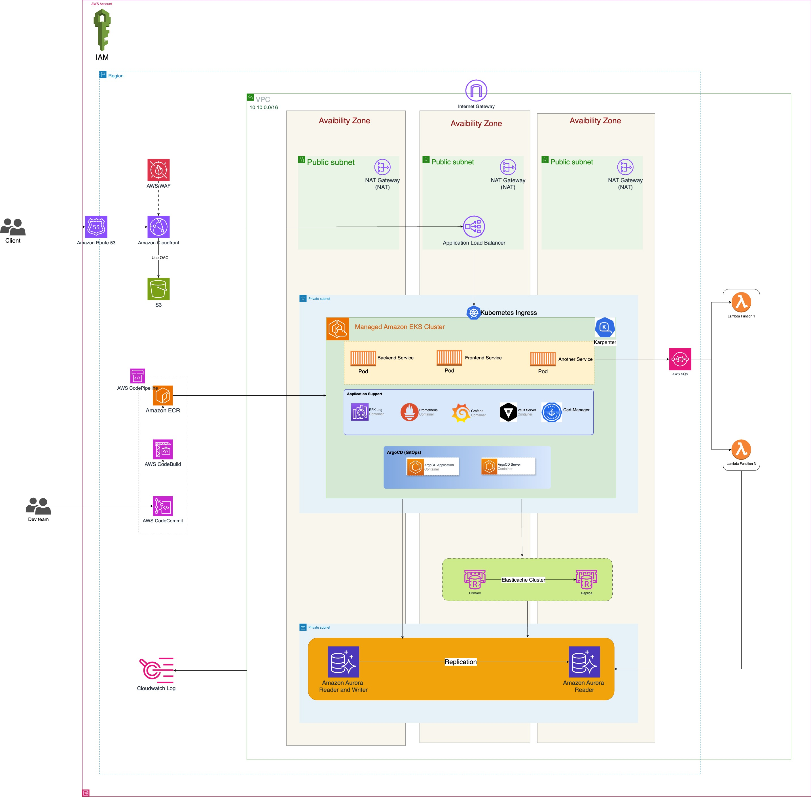

# Architecture Design
- Route53: I chose Route 53 as the DNS provider. Route 53 is chosen for deep AWS integration, failover, and scalability.
  - Why Route 53:
    - Global DNS Resolution: Directs users to the closest AWS region.
    - Health Checks & Failover: Automatically routes traffic to healthy endpoints.
    - Latency-Based Routing: Ensures the lowest-latency experience for traders worldwide.
  - Alternatives Considered: 
    - CloudflareDNS

- Cloudfront + WAF:
  - Why CloudFront?
    - Caches static assets (React frontend, CSS, JavaScript, images) at over 450+ edge locations.
    - Reduces load on backend servers and improves response times.
    - Handles millions of requests per second with auto-scaling.

  - Why AWS WAF?
    - DDoS Protection: Blocks malicious traffic before it reaches the backend.
    - Web Filtering: Prevents SQL injection, XSS, and API abuse.
    - Rate Limiting: Protects against bot traffic and brute-force attacks.

  - Alternatives Considered
    - Cloudflare CDN: Strong DDoS protection but lacks AWS-native security controls.

- Cloudfront + S3: Choosing CloudFront with S3 to host static files in AWS
  - Performance & Low Latency
    - CloudFront Caching: Delivers content from edge locations closest to users, reducing load times, reducing S3 GET requests (lowers costs)
    - Reduced Latency: Avoids round trips to the origin S3 bucket.
    - S3 with 99.999999999% durability for data storage
  - Cheaper than hosting static files on a traditional server 
  - Protects S3 from direct access using Origin Access Control (OAC).

- AWS EKS:
  - Amazon Elastic Kubernetes Service (EKS) is the preferred choice for orchestrating microservices in this architecture due to its ability to efficiently manage, scale, and optimize containerized workloads in a highly available and cost-effective manner.
  - AWS fully manages the Kubernetes control plane, including automatic patching, upgrades, and availability, allowing the engineering team to focus on business logic instead of infrastructure management. The control plane is distributed across multiple Availability Zones (AZs) by default, ensuring resilience against failures and minimizing downtime. Reduces the complexity of maintaining self-managed Kubernetes clusters, freeing up operational resources.
  - Ensures high availability with multi-AZ deployments. The worker nodes (EC2 instances or Fargate tasks) can be deployed across multiple AZs to prevent single points of failure. Kubernetes self-healing mechanisms (such as node draining, pod rescheduling, and automatic restarts) ensure high reliability.
  - EKS supports Spot Instances, which significantly reduce compute costs by leveraging unused EC2 capacity at discounted rates. This is ideal for non-critical workloads like batch processing and asynchronous tasks. AWS Savings Plans help reduce the cost of on-demand instances for predictable workloads by providing flexible pricing options.
  - Leverages the extensive Kubernetes ecosystem and community support. Karpenter optimizes scaling time by provisioning the right-sized nodes at the right time, improving response time and cost efficiency.
  - EKS supports automatic scaling of pods based on CPU, memory, and custom application metrics using Horizontal Pod Autoscaler (HPA). Kubernetes-based Event Driven Autoscaling (KEDA) dynamically adjusts workloads based on external events such as SQS message queues, Kafka topics, or Prometheus metrics.
  -  EKS integrates with AWS Identity and Access Management (IAM) to enforce least-privilege access for different microservices, reducing the risk of unauthorized access. IAM Roles for Service Accounts (IRSA) allow Kubernetes pods to securely interact with AWS services without hardcoded credentials.
  - Be able to integrate with the GitOps system. Ensures that deployments are declarative, version-controlled, and auditable, reducing configuration drift. Allows easy rollback and recovery in case of deployment failures.
  - AWS CloudWatch Logs is often used for log storage, but it can become expensive at scale. EKS integrates with OpenTelemetry, FluentBit, and ELK (Elasticsearch, Logstash, Kibana) stacks to provide cost-effective log aggregation and analytics. Supports monitoring tools like Prometheus and Grafana for real-time observability of application health and performance
  - Vault Secrets: Provides a more native method to retrieve and sync Kubernetes Secrets that include post-rotation updates. 

  - In this architecture, AWS Application Load Balancer (ALB) is integrated with EKS Ingress to efficiently handle incoming traffic and route it to the appropriate microservices running in Amazon EKS. This integration offers several advantages, including scalability, security, cost efficiency, and Kubernetes-native traffic management. 
    - ALB distributes traffic across multiple Availability Zones (AZs), improving fault tolerance and availability.
    - Supports deep integration with AWS services such as WAF (Web Application Firewall), ACM (AWS Certificate Manager), and Route 53 for enhanced security and reliability. 
    - Supports Layer 7 (HTTP/HTTPS) traffic, enabling advanced routing and filtering capabilities

  - Alternatives Considered
    - ECS: Simple to use but has drawbacks compared to EKS
      - Limited Portability (Vendor Lock-in)
      - Do not support GitOps System. 
      - Less Community & Open-Source Support.
      - More Expensive at Scale.
    - API Gateway: Better for serverless applications but expensive for high traffic
- Aurora and Elasticache:
  - Amazon Aurora and Amazon ElastiCache are used to optimize transaction processing, scalability, and latency reduction, ensuring the system can handle millions of concurrent users and high-frequency trades.
  - With role DevOps, I think I only care about these:
    - Aurora:
      - Aurora provides 5x the performance of a standard MySQL database and 3x the performance of PostgreSQL due to its distributed, multi-node architecture.
      - Handles millions of reads per second and thousands of writes per second, crucial for trading platforms.
      - Multi-AZ Replication: Automatically replicates data across 6 copies in 3 Availability Zones (AZs).
      - Automatic Failover: If the primary instance fails, Aurora automatically promotes a read replica as the new primary with minimal downtime.
      - Auto-Scaling Read Replicas: Supports up to 15 read replicas for handling large read-heavy workloads.
      - Supports both MySQL and PostgreSQL, making it easy to migrate existing applications.
    - Elasticache: 
      - Reduces the load on Aurora by caching frequently accessed queries.
      - Supports millions of requests per second, perfect for handling market data and price feeds.
      - Ensures high availability with replicas and automatic failover.
      - Backup & Restore Capabilities to prevent data loss.
      - Reduces direct queries to Aurora, lowering database costs

    |          Alternative         |                    Pros                   |                    Cons                    | Reason for Choice |   |
    |:----------------------------:|:-----------------------------------------:|:------------------------------------------:|:-----------------:|---|
    | DynamoDB Accelerator (DAX)   | Fully managed, fast for key-value lookups | Not suitable for complex caching scenarios |                   |   |
    | CloudFront Edge Caching      | Good for static content (CDN)             | Not ideal for dynamic trading data         |                   |   |
    | Self-Managed Redis/Memcached | More control over configurations          | Requires maintenance and scaling effort    |                   |   |

- SQS & Lambda:
  - In a highly available trading platform, handling asynchronous tasks, order processing, and failure recovery is critical. Amazon SQS (Simple Queue Service) and AWS Lambda play a crucial role in decoupling services, ensuring fault tolerance, and scaling automatically based on demand.
  - With Lambda, unlike EC2/EKS, there are no charges when there is no workload.
  - With role DevOps, I think I only care about these:
    - SQS:
      - Ensures that order placement, trade execution, and settlement are processed independently.
      - Prevents overloading Aurora or EKS during traffic spikes.
      - Stores messages for up to 14 days, preventing data loss if a consumer fails.
      - Dead Letter Queue (DLQ) ensures failed messages are retried or analyzed later.
      - Can handle millions of messages per second, perfect for a high-frequency trading system.
      - Supports FIFO queues for ordered execution of trades.
      - Helps avoid excessive load on Aurora and EKS during traffic spikes